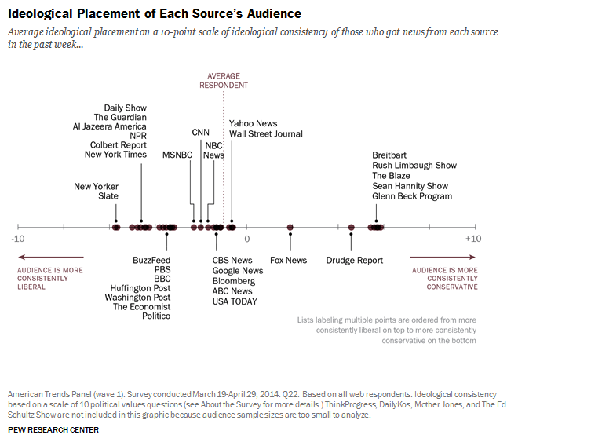

# Tabs Project

### To run the code
- Clone the repository and run `yarn` or `npm install`
- Rename `config.js.example` to `config.js`
- Add a valid api key as a string to the renamed config file
- Run `yarn start` or `npm start`
- Open a browser window at localhost:3000

### To run the tests
Run `npm test` or `yarn test`

Launches the test runner in the interactive watch mode. 
See the section about [running tests](https://facebook.github.io/create-react-app/docs/running-tests) for more information.

### Notes
#### Tools I used
- Create React App
- Materializecss (which uses jquery)
- Jest and Enzyme

#### Reading time
I decided to add a reading time measurement to the tabs as I find this useful when deciding what to read from a list. I calculated the reading time based on a measurement of 275 words per minute, which I found in [this Medium article](https://blog.medium.com/read-time-and-you-bc2048ab620c). The article mentions that you should add 12 seconds for every image in the article and I would have liked to do this but I couldn't see a quick and easy way of counting the number of images in each article.

#### Other ideas
I would have liked to play around with natural language processing on the articles - perhaps some political bias analysis could be interesting (see image, below), or maybe adding a filter for younger people to consume the news with disturbing news filtered out. However, after browsing some of the major NLP APIs, I thought this work might take me way out of the two-hour time limit, so I didn't attempt to implement them.

